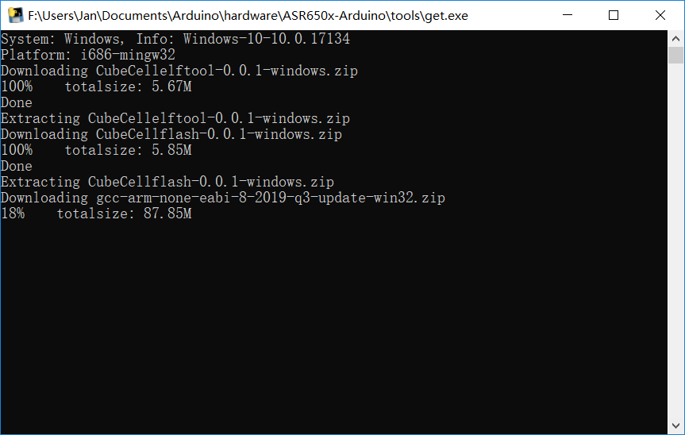
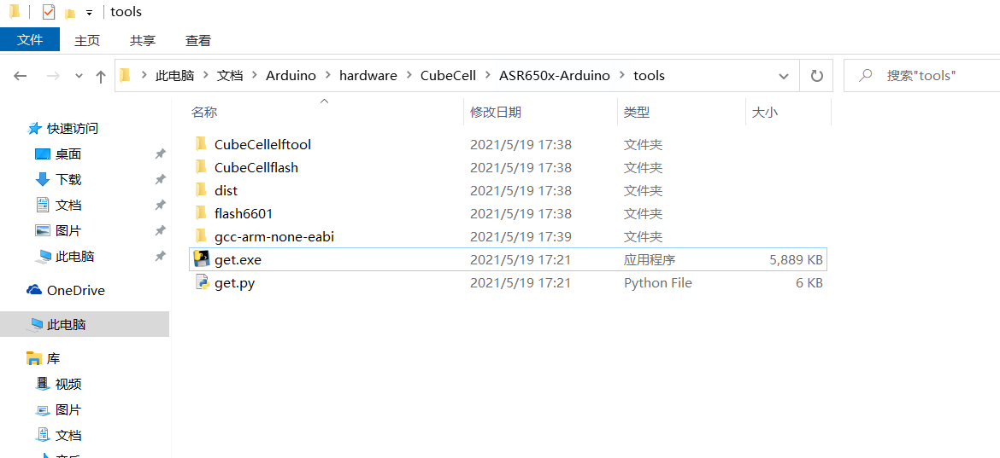
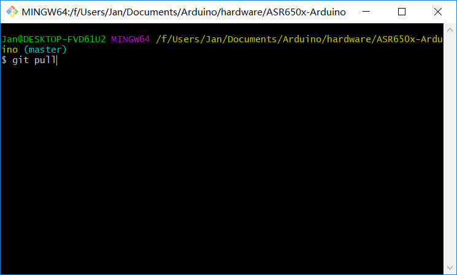

# Steps to install Arduino ASR650x support on Windows
### Install the development framework

**Tested with Windows 10 64 bit**

1. Download and install the latest Arduino IDE ```Windows Installer``` from [arduino.cc](https://www.arduino.cc/en/Main/Software);
2. Download and install Git from [git-scm.com](https://git-scm.com/download/win);
3. Execute the command under the **\Documents\Arduino\hardware\CubeCell** path (Must in this path),
   start ```Git Bash``` and input `git clone https://github.com/HelTecAutomation/ASR650x-Arduino.git`


4. Open ```/Documents/Arduino/hardware/CubeCell/ASR650x-Arduino/tools``` and double-click ```get.exe```



5. When ```get.exe``` running finished, you will be able to see the following files in the directory;



6. Plug in your CubeCell via a high quality Micro USB cable, if CP2102 UART-USB bridge didn't install automatically, please refer to this document: [Establish Serial Connection](https://docs.heltec.cn/#/en/user_manual/establish_serial_connection)

7. Start Arduino IDE, select relevant board in ```Tools > Board``` menu, and correctly config the `menu`;

8. Compile and upload.


### Update to the latest code

1. In the ```/Documents/Arduino/hardware/CubeCell/ASR650x-Arduino```  path, open a git command shell, input ```git pull```



2. Wait for git pull to end;

3. Open ```/Documents/Arduino/hardware/CubeCell/tools``` and run ```get.exe``` again.

