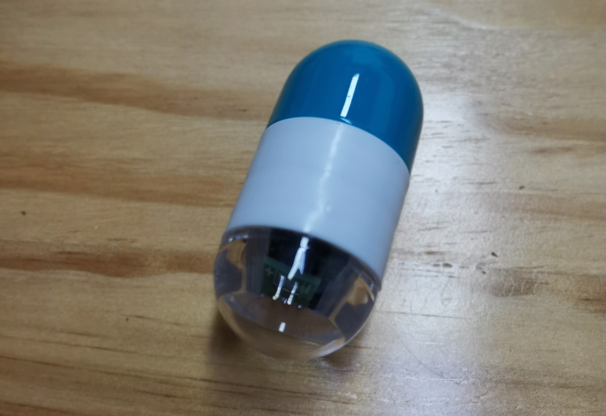

## Sensors Basic  example 

| sensor model |               Function               |
| :----------: | :----------------------------------: |
|    BH1750    |    Lighting intensity measurement    |
|    BMP180    | Temperature and Pressure measurement |
|    CCS811    |       Air quality measurement        |
|   HDC1080    | Temperature and humidity Measurement |
|   MPU9250    |            9-axis sensor             |

* [examples links ](https://github.com/HelTecAutomation/ASR650x-Arduino/tree/master/libraries/SensorBasic/examples)
*  These products are all produced by **Heltec AutoMation**.
* These example don't support [LoRa Wan](https://github.com/HelTecAutomation/ASR650x-Arduino/tree/master/libraries/LoRa/examples/LoRaWAN_Sensors)

####  preview 

